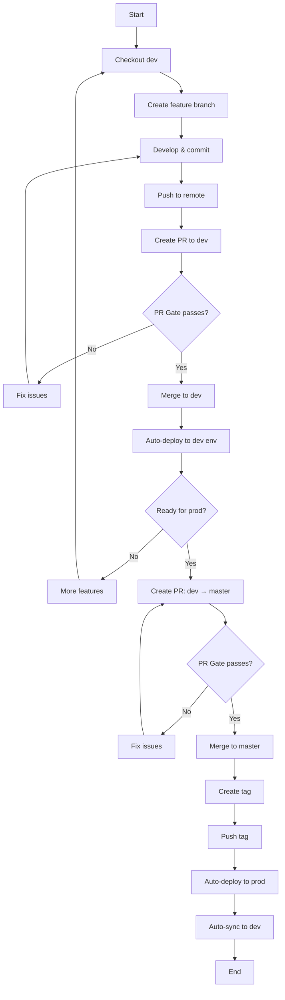

# Development Workflow

This guide describes the standard development workflow for projects using this template.

## Branch Strategy

```
feature/* → dev → master
              ↓      ↓
           dev env  prod env
```

### Branch Roles

| Branch | Purpose | Auto-deploy | Protected |
|--------|---------|-------------|-----------|
| `master` | Production code | On tag push | ✅ Yes |
| `dev` | Integration/staging | On merge | ✅ Yes |
| `feature/*` | New features | No | ❌ No |
| `fix/*` | Bug fixes | No | ❌ No |
| `hotfix/*` | Emergency fixes | No | ❌ No |

### Branch Naming

- `feature/add-user-auth` - New features
- `fix/login-timeout` - Bug fixes
- `hotfix/critical-security-patch` - Emergency fixes
- `docs/update-readme` - Documentation changes
- `refactor/cleanup-utils` - Code refactoring
- `test/add-integration-tests` - Test additions

## Standard Development Flow

### 1. Start New Work

```bash
# Ensure dev is up to date
git checkout dev
git pull origin dev

# Create feature branch
git checkout -b feature/my-feature
```

### 2. Develop and Commit

```bash
# Make changes
vim src/my_module.py

# Run checks locally
uv run poe format  # Format code
uv run poe lint    # Run linters
uv run poe test    # Run tests

# Commit with Conventional Commits
git add src/my_module.py
git commit -m "feat: add user authentication"
```

**Commit Message Format:**

```
<type>(<scope>): <subject>

[optional body]

[optional footer]
```

**Types:**
- `feat`: New feature
- `fix`: Bug fix
- `docs`: Documentation changes
- `style`: Code style changes (formatting, etc.)
- `refactor`: Code refactoring
- `perf`: Performance improvements
- `test`: Adding or updating tests
- `build`: Build system changes
- `ci`: CI/CD changes
- `chore`: Other changes (dependencies, etc.)

**Examples:**

```bash
# Simple feature
git commit -m "feat: add user login endpoint"

# Bug fix with scope
git commit -m "fix(auth): resolve token expiration issue"

# Breaking change
git commit -m "feat!: remove deprecated API endpoints"

# With body
git commit -m "feat: add email notifications

Implements email notifications for:
- User registration
- Password reset
- Account updates

Closes #123"
```

### 3. Push and Create PR

```bash
# Push feature branch
git push origin feature/my-feature

# Create PR on GitHub
# Use the provided link or go to GitHub UI
```

### 4. Fill PR Template

The PR template will auto-populate. Fill in all sections:

```markdown
# 变更目的
- Add user authentication system

# 影响范围
- 前端页面/路由：/login, /register
- 后端接口（路径/方法）：POST /api/auth/login, POST /api/auth/register
- 算法 schema/版本：N/A
- DB 迁移：Yes (adds users table)

# 测试证据（必须可复现）
- 测试命令/步骤：
  1. uv run poe test
  2. Manual test: curl -X POST http://localhost:8000/api/auth/login
- 结果/截图/日志链接：
  - All tests pass
  - Screenshot: [link]

# 风险点
- Database migration required
- Existing users need to re-register

# 回滚方案（必填）
- 回滚目标 commit/image tag：abc123
- 回滚入口/脚本：git revert abc123
- 回滚后验证点：Login page returns to old version

# 跨仓库依赖
- 需要配合的仓库与事项：Frontend repo needs to update login form

# 提交前自检
- [x] PR 标题符合 Conventional Commits（用于自动版本）
- [x] 已说明风险与回滚
- [x] 证据完整且可复现
- [x] 遵守 `dev`/`master` 仅 PR 合并规则
```

### 5. Wait for PR Gate

The PR Gate workflow will automatically run:

1. **Format Check** - Ruff format
2. **Lint Check** - Ruff + mypy
3. **Tests** - pytest
4. **Smoke Test** - Basic functionality check

**All checks must pass before merging.**

### 6. Address Review Comments

```bash
# Make requested changes
vim src/my_module.py

# Commit changes
git add src/my_module.py
git commit -m "fix: address review comments"

# Push updates
git push origin feature/my-feature
```

PR Gate will run again automatically.

### 7. Merge PR

Once approved and all checks pass:

1. Click "Squash and merge" on GitHub
2. Confirm the commit message follows Conventional Commits
3. Delete the feature branch (auto-deleted if configured)

**Result:** Changes are now in `dev` and auto-deployed to dev environment.

## Release Process

### When to Release

- Weekly releases (recommended)
- After significant features
- For critical bug fixes

### Release Steps

#### 1. Create Release PR (dev → master)

```bash
# Ensure dev is up to date
git checkout dev
git pull origin dev

# Create PR on GitHub: dev → master
```

Fill in the PR template with:
- Summary of changes since last release
- Breaking changes (if any)
- Migration steps (if any)

#### 2. Wait for PR Gate

Same checks as feature PRs.

#### 3. Merge to Master

Once approved:
1. Squash and merge
2. Master now has the latest code

#### 4. Create Version Tag

```bash
# On master branch
git checkout master
git pull origin master

# Create tag (auto-calculates version)
uv run poe tag

# Push tag
git push origin master --tags
```

**What happens:**
1. `semantic-release` calculates next version based on commits
2. Updates `CHANGELOG.md`
3. Updates version in `pyproject.toml`
4. Creates git tag (e.g., `v1.4.0`)
5. Commits changes

#### 5. Automated Deployment

Pushing the tag triggers:

1. **Prod Deploy Workflow**
   - Builds production artifacts
   - Deploys to production
   - Monitors health

2. **Release Workflow**
   - Extracts release notes from CHANGELOG
   - Creates GitHub Release

3. **Sync Workflow**
   - Automatically syncs master changes back to dev

## Hotfix Process

For critical production issues that can't wait for the normal release cycle.

### 1. Create Hotfix Branch

```bash
# From master (production code)
git checkout master
git pull origin master

# Create hotfix branch
git checkout -b hotfix/critical-security-patch
```

### 2. Fix and Test

```bash
# Make minimal changes
vim src/security.py

# Test thoroughly
uv run poe test

# Commit
git commit -m "fix: patch critical security vulnerability"
```

### 3. Create PR to Master

```bash
# Push hotfix
git push origin hotfix/critical-security-patch

# Create PR: hotfix/* → master
```

**Important:** Hotfixes go directly to master, bypassing dev.

### 4. Deploy Hotfix

```bash
# After PR is merged
git checkout master
git pull origin master

# Create hotfix tag
uv run poe tag

# Push tag (triggers deployment)
git push origin master --tags
```

### 5. Backport to Dev

```bash
# Merge master back to dev
git checkout dev
git merge master
git push origin dev
```

Or wait for the auto-sync workflow to handle it.

## Common Scenarios

### Scenario 1: Multiple Features in Parallel

```bash
# Developer A
git checkout -b feature/user-auth

# Developer B
git checkout -b feature/payment-integration

# Both work independently
# Both create PRs to dev
# Both get merged to dev
# Both get deployed to dev environment
```

### Scenario 2: Feature Depends on Another

```bash
# Wait for first feature to merge to dev
# Then create your feature branch from dev

git checkout dev
git pull origin dev
git checkout -b feature/depends-on-auth
```

### Scenario 3: Long-running Feature

```bash
# Keep feature branch up to date with dev
git checkout feature/long-running
git merge dev
git push origin feature/long-running

# Or rebase (if no one else is working on the branch)
git rebase dev
git push origin feature/long-running --force-with-lease
```

### Scenario 4: Rollback Production

```bash
# Find the last good tag
git tag -l

# Revert to previous version
git checkout master
git revert <bad-commit-sha>
git push origin master

# Or deploy previous tag
# (depends on your deployment system)
```

## Best Practices

### Commits

- ✅ Make small, focused commits
- ✅ Write clear commit messages
- ✅ Follow Conventional Commits format
- ✅ Commit working code (tests pass)
- ❌ Don't commit commented-out code
- ❌ Don't commit debug statements
- ❌ Don't commit secrets or credentials

### Pull Requests

- ✅ Keep PRs small (< 400 lines changed)
- ✅ Fill out the PR template completely
- ✅ Add screenshots for UI changes
- ✅ Link related issues
- ✅ Request reviews from relevant people
- ❌ Don't merge your own PRs (unless solo project)
- ❌ Don't force-push after review starts

### Branches

- ✅ Delete branches after merging
- ✅ Keep feature branches short-lived (< 1 week)
- ✅ Sync with dev regularly
- ❌ Don't push directly to dev/master
- ❌ Don't rebase shared branches

### Testing

- ✅ Run tests locally before pushing
- ✅ Add tests for new features
- ✅ Update tests for bug fixes
- ✅ Test edge cases
- ❌ Don't skip tests
- ❌ Don't commit failing tests

## Troubleshooting

### Issue: Pre-commit hooks failing

```bash
# Run checks manually
uv run poe format
uv run poe lint

# Fix issues and try again
git commit -m "feat: my feature"
```

### Issue: Merge conflicts

```bash
# Update your branch with latest dev
git checkout feature/my-feature
git fetch origin
git merge origin/dev

# Resolve conflicts
vim conflicted-file.py

# Mark as resolved
git add conflicted-file.py
git commit -m "merge: resolve conflicts with dev"
```

### Issue: Wrong commit message

```bash
# Amend last commit (if not pushed)
git commit --amend -m "feat: correct message"

# If already pushed, create new commit
git commit --allow-empty -m "docs: fix previous commit message"
```

### Issue: Accidentally committed to dev

```bash
# Create a new branch from current state
git branch feature/accidental-commit

# Reset dev to origin
git checkout dev
git reset --hard origin/dev

# Continue work on feature branch
git checkout feature/accidental-commit
```

## Workflow Diagram



## Next Steps

- [Explore Features](features.md)
- [GitHub Setup Guide](github-setup.md)
- [Customize Workflows](.github/workflows/)
